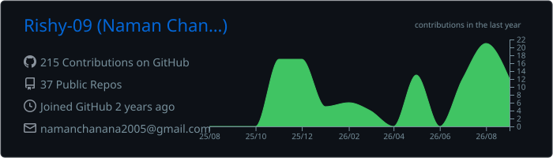
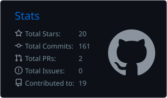
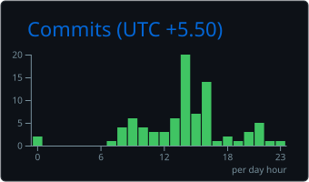
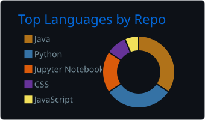
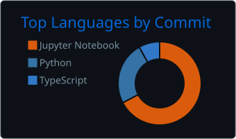

<!--
  Rishy-09 GitHub Profile — V4 final polish
  Motion is SVG/CSS only; no JavaScript required inside GitHub README.
  Activity cards are generated by GitHub Actions and update on schedule/workflow dispatch.
-->

  

  
  
  
  
  

<h2 align="center">AI/ML + Full-Stack Engineer</h2>

  <b>I build intelligent systems end-to-end:</b> local voice agents, RAG backends, Transformer experiments, MERN dashboards, APIs, memory layers, and deployment-style products.

  

## Flagship systems

<table>
<tr>
<td width="50%">

</td>
<td width="50%">

</td>
</tr>
<tr>
<td width="50%">

</td>
<td width="50%">

</td>
</tr>
</table>

 

  

 

  

 

## Activity console

 

  

  

 

<table align="center">
  <tr>
    <td width="50%" align="center">
      
    </td>
    <td width="50%" align="center">
      
    </td>
  </tr>
</table>

 

<table align="center">
  <tr>
    <td width="50%" align="center">
      
    </td>
    <td width="50%" align="center">
      
    </td>
  </tr>
</table>

 

  These cards are generated by GitHub Actions. They are real GitHub-derived stats, saved as static SVGs, and refreshed when the workflow runs.

 

  

 

  

  Systems-first profile · local AI, full-stack engineering, and no fake perfection

