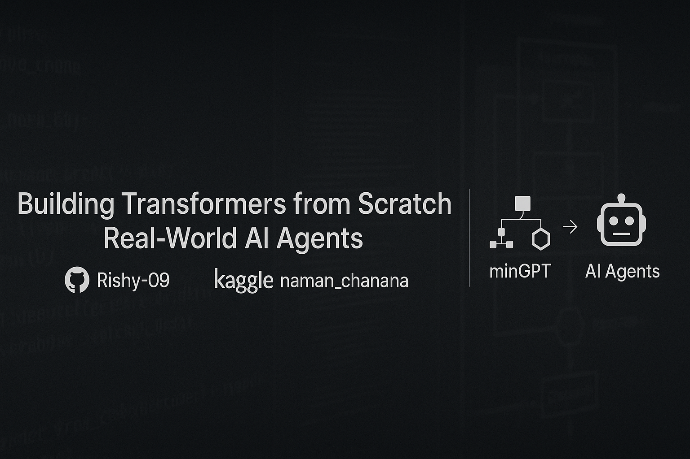

  

<h1 align="center">Hi 👋, I'm Naman</h1>
<h3 align="center">Transformers | ML Engineer in Progress | Backend Dev</h3>

  
  

---

### 🧠 About Me

- 🎓 I'm pursuing BTech in CSE with a major in **Machine Learning**  
- 🔬 Currently exploring and building **GPT-style transformer models**  
- ⚙️ Built a decoder-only transformer for **spell correction** using PyTorch  
- 🔧 Customizing Karpathy’s **minGPT** and scaling via **NanoGPT**  
- 🐞 Created a **Bug Tracking System** with role-based access, file uploads, and email alerts  
- 💼 Interning at **Hashbyte Studio**, learning systems in gaming environments  
- 🧭 Building my **AI Agent Mastery Roadmap** to reach top 1% LLM devs  
- 🚀 Goal: Intern / freelance / contribute in ML within next **5 months**

---

### 🛠️ Languages and Tools

  
  
  
  
  
  
  
  
  
  

---

### 🚀 Highlight Projects

#### 🧠 SpellCorrection-GPT
> Transformer-based GPT decoder model trained to fix noisy sentences.

- Custom BPE tokenizer
- Implemented multi-head attention, feed-forward layers, and layer norm from scratch
- Trained in PyTorch on noisy-clean sentence pairs
- [GitHub Repo](https://github.com/Rishy-09/minGPT-custom) | [Kaggle Notebook](https://www.kaggle.com/code/namanchanana/mini-gpt/edit) 

#### 🐞 Fullstack Bug Tracking System
> Role-based bug tracker built with Node.js, Express, MongoDB, React.

- Admin/Tester/Developer role flows
- Real-time email notifications
- File uploads and download routes
- Modular API structure
- [Repo Link](https://github.com/Rishy-09/CtrlX_Error)

#### 🧭 AI Agent Mastery Roadmap
> Curated Notion/GitHub plan for mastering LLMs, AutoGPTs, and AI agents.

- Phase-based roadmap (Foundations → Projects → Agent Systems → Mastery)
- Includes lecture notes from CS224n, YouTube, blogs, and papers
- [In Progress]

---

### 📊 GitHub Stats

  
  

---

### 📈 Contribution Graph

---

### 📫 Contact

- 💼 LinkedIn: [linkedin.com/in/naman-rishy09](https://www.linkedin.com/in/naman-chanana-229317299/)
- 📊 Kaggle: [kaggle.com/Rishy09](https://www.kaggle.com/namanchanana)
- 📨 Email: [namanchanana2005@gmail.com]

---

### 💡 Currently Exploring
- Scaling SpellCorrectionGPT with NanoGPT
- Real-time AI agents and toolformer models
- Kaggle challenges (NLP, tabular ML)
- Self-hosted RAG pipelines

---

### 🧩 Fun Fact
> I don't just learn models, I break them, rebuild them, and make them work for **real use-cases.**
