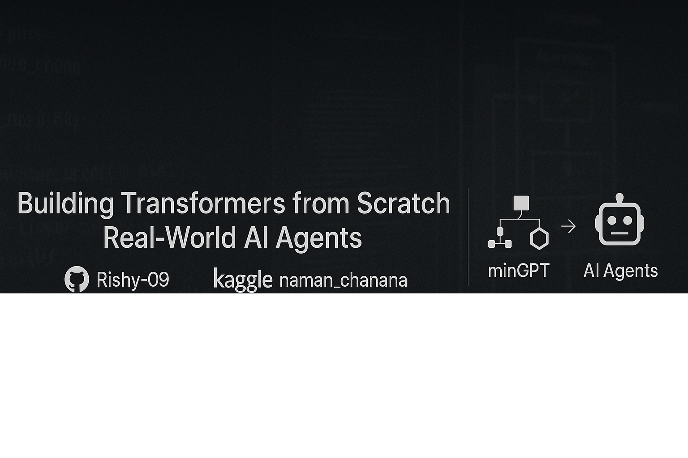
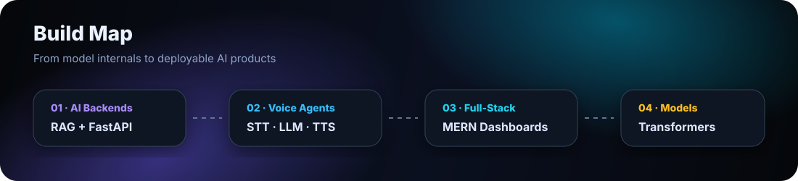
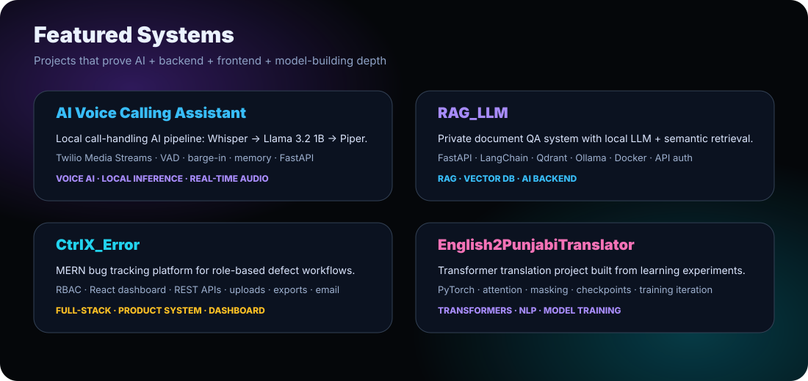
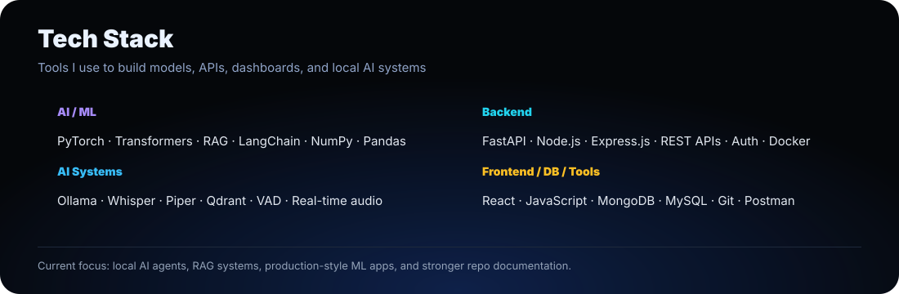
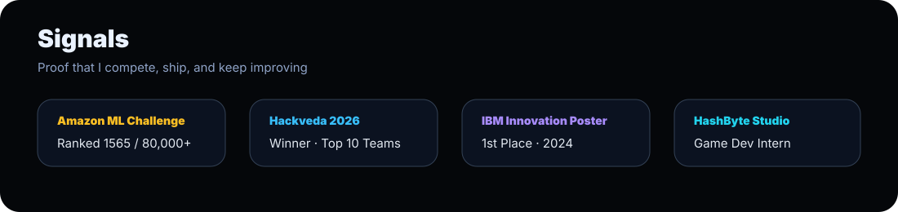

<!--
Profile README for github.com/Rishy-09
Built as a dark AI-lab / neural systems profile.
Email intentionally hidden.
-->

<p align="center">
  
</p>

<h1 align="center">Naman Chanana</h1>

<p align="center">
  <b>AI/ML + Full-Stack Engineer</b><br/>
  Building intelligent systems end-to-end: <b>voice agents</b>, <b>RAG pipelines</b>, <b>Transformer models</b>, APIs, dashboards, and deployable products.
</p>

<p align="center">
  <a href="https://github.com/Rishy-09"></a>
  <a href="https://www.linkedin.com/in/naman-chanana-229317299/"></a>
  <a href="https://www.kaggle.com/namanchanana"></a>
  <a href="https://leetcode.com/u/Naman_Chanana/"></a>
  <a href="https://codolio.com/profile/xvYw0Y2E"></a>
</p>

<br/>

<p align="center">
  
</p>

## What I build

I like projects where the full system matters — not just one notebook or one screen.

- **AI backends**: RAG systems, local LLM inference, semantic search, PDF/document QA.
- **Voice agents**: STT → LLM → TTS pipelines, turn-taking, barge-in, memory, telephony.
- **Full-stack systems**: MERN dashboards, REST APIs, RBAC, auth, file handling, exports.
- **Model internals**: Transformers, translation models, tokenization, attention, training loops.
- **ML fundamentals**: K-Means, image compression, evaluation trade-offs.

<p align="center">
  
</p>

## Featured repositories

<table>
<tr>
<td width="50%" valign="top">

### ☎️ AI Voice Calling Assistant
Production-grade prototype for intelligent call delegation and context-aware call handling.

**Highlights**
- Local inference: Whisper + Llama 3.2 1B + Piper
- Twilio Voice Media Streams
- VAD, barge-in, µ-law/PCM audio handling
- Ground-truth context, profile memory, semantic call memory

<a href="https://github.com/Call-AI-Engine/AI-Voice-Calling-Assistant"><b>View repository →</b></a>

</td>
<td width="50%" valign="top">

### 🧠 RAG_LLM
Local and private Retrieval-Augmented Generation system for document QA.

**Highlights**
- FastAPI backend
- LangChain RAG pipeline
- Qdrant vector database
- Ollama local LLM
- Dockerized deployment + API-key auth

<a href="https://github.com/Rishy-09/RAG_LLM"><b>View repository →</b></a>

</td>
</tr>
<tr>
<td width="50%" valign="top">

### 🐞 CtrlX_Error
Full-stack bug tracking platform for managing software defects.

**Highlights**
- MERN stack
- Role-Based Access Control
- React dashboard
- REST APIs
- File uploads, exports, filtering, email notifications

<a href="https://github.com/Rishy-09/CtrlX_Error"><b>View repository →</b></a>

</td>
<td width="50%" valign="top">

### 🔤 English2PunjabiTranslator
Transformer-based translation project built from learning, failure, iteration, and rebuilds.

**Highlights**
- PyTorch Transformer implementation
- Tokenization + masking + training pipeline
- Checkpointing and scheduler flow
- Honest model iteration and dataset-bias handling

<a href="https://github.com/Rishy-09/English2PunjabiTranslator"><b>View repository →</b></a>

</td>
</tr>
</table>

### Also worth checking

- [K-Means Image Compression](https://github.com/Rishy-09/kmeans-image-compression) — classical ML visual project using K-Means clustering for RGB compression.
- More experiments live across my repositories as I keep pushing through ML, DSA, backend, and AI-agent systems.

<p align="center">
  
</p>

## GitHub activity

<p align="center">
  
  
</p>

<p align="center">
  
</p>

<p align="center">
  
</p>

<p align="center">
  
</p>

## Current focus

```txt
Local AI Agents     → voice calling, memory, real-time inference
RAG Systems         → document QA, retrieval, citations, private knowledge bases
Transformers        → training loops, attention, translation, GPT-style models
Full-Stack Products → APIs, dashboards, auth, deployment-style architecture
DSA + Interviews    → Java problem-solving and system thinking
```

## Operating principle

> Build the model. Build the backend. Build the interface. Then make it usable.

<p align="center">
  <sub>Dark AI-lab profile system · maintained by <b>Rishy-09</b></sub>
</p>
