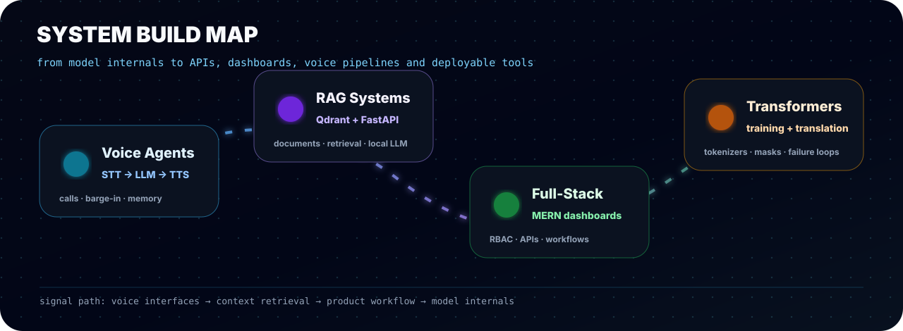
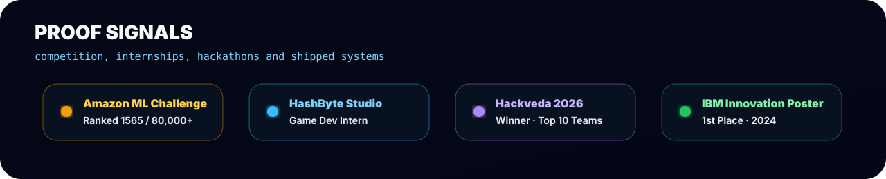
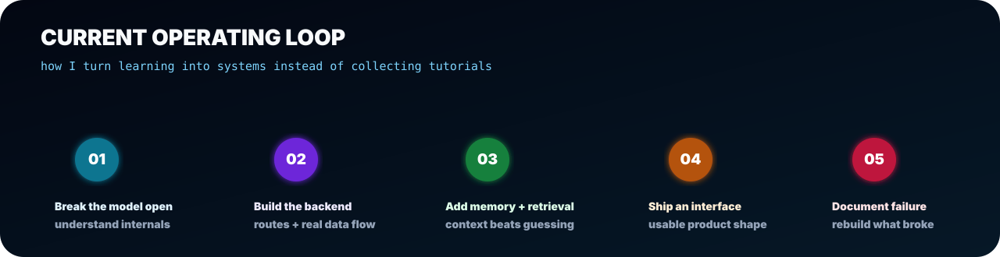

<!--
  Rishy-09 GitHub Profile — V3 Systems Lab polish
  Email intentionally hidden. Motion is SVG/CSS only; no JavaScript required.
-->

  

  
  
  
  
  

<h2 align="center">AI/ML + Full-Stack Engineer</h2>

  <b>I build intelligent systems end-to-end:</b> local voice agents, RAG backends, Transformer experiments, MERN dashboards, APIs, memory layers, and deployment-style products.

  

## Flagship systems

<table>
<tr>
<td width="50%">

</td>
<td width="50%">

</td>
</tr>
<tr>
<td width="50%">

</td>
<td width="50%">

</td>
</tr>
</table>

  

  

## Activity console

  <!--  -->
  

  

  

  

  

  Systems-first profile · local AI, full-stack engineering, and no fake perfection

